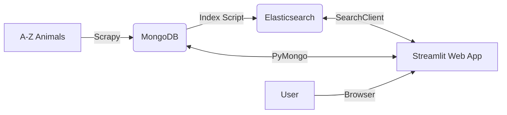

# 🦁 Scraping Animals & Search Engine

A full-stack data engineering project that scrapes animal data from [A-Z Animals](https://a-z-animals.com/), indexes it into **Elasticsearch**, and serves it via a **Streamlit** web application with advanced search capabilities.

## 🚀 Features

- **Robust Scraper**:
  - Built with **Scrapy**.
  - **Generic Extraction**: Automatically captures *all* available fields (Physical Characteristics, Fun Facts, etc.) dynamically.
  - **Resilient**: Uses `scrapy-impersonate` to bypass WAF/403 protections.
  - **MongoDB Storage**: Directly pipelines scraped data into a MongoDB database.

- **Search Engine**:
  - **Elasticsearch Integration**: Fast, full-text search with typo tolerance ("fuzziness").
  - **Fallback Mechanism**: Automatically defaults to basic substring search if Elasticsearch is offline.

- **Web Application**:
  - **Streamlit Interface**: Interactive dashboard to explore animal data.
  - **Filtering**: Filter by Diet, Habitat, Country.
  - **Geospatial Visualization**: Folium maps showing animal locations.
  - **Statistics**: Real-time metrics on the dataset.

## 🛠 Architecture



## 📦 Installation

### Prerequisites
- Docker & Docker Compose
- Python 3.9+ (for local development)

### Quick Start (Docker)

1.  **Clone the repository**:
    ```bash
    git clone https://github.com/wilfried-lafaye/scraping-animals.git
    cd scraping-animals
    ```

2.  **Launch Services**:
    ```bash
    docker compose up -d --build
    ```
    This starts:
    - MongoDB (Port 27017)
    - Elasticsearch (Port 9200)
    - Kibana (Port 5601)
    - Streamlit App (Port 8501)

3.  **Index Data**:
    Once services are running, index the data into Elasticsearch:
    ```bash
    # From your local machine (requires python env)
    ./.venv/bin/python3 scripts/index_animals_es.py
    
    # OR from within the web container
    docker compose exec webapp python3 ../scripts/index_animals_es.py
    ```

4.  **Access the App**:
    Open [http://localhost:8501](http://localhost:8501) in your browser.

## 🕷️ Scraper Usage

To run the scraper manually (local environment):

```bash
# Activate virtual environment
source .venv/bin/activate

# Go to scrapy directory
cd scrapy

# Run spider (limited to 10 items for testing)
scrapy crawl animals -s CLOSESPIDER_ITEMCOUNT=10
```

## 🧪 Testing

Run quality assurance tests:

```bash
# Run unit tests (Spider logic, JSON validation)
pytest tests/

# Check code style
flake8 webapp/ scrapy/
```

## 📂 Project Structure

- `scrapy/`: Scrapy project (Spider, Pipelines, Settings).
- `webapp/`: Streamlit application code.
- `scripts/`: Utility scripts (Indexing).
- `tests/`: Unit and integration tests.
- `data/`: Local storage for scraped JSON data.

## 📝 Roadmap & Status

See [ROADMAP.md](./ROADMAP.md) for detailed progress history.

---
*Created by the Data Engineering Team at ESIEE Paris.*