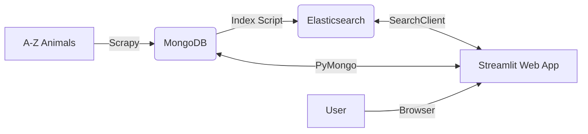

# 🦁 Scraping Animals & Search Engine

> 🤖 **Note** : Ce projet a été réalisé en *pair programming* avec un assistant IA.

Projet full-stack de data engineering qui **scrape** des fiches d’animaux depuis [A-Z Animals](https://a-z-animals.com/), les **stocke dans MongoDB**, les **indexe dans Elasticsearch**, puis les expose via une **application Streamlit** avec recherche avancée.

## ✨ Fonctionnalités

- **Scraper robuste (Scrapy)**
  - Extraction **générique** et dynamique des champs (caractéristiques physiques, fun facts, etc.).
  - Contourne les protections WAF/403 via `scrapy-impersonate`.
  - Pipeline direct vers **MongoDB**.

- **Moteur de recherche**
  - **Elasticsearch** pour la recherche plein texte avec tolérance aux fautes (fuzzy).
  - **Fallback** automatique vers une recherche simple si Elasticsearch est indisponible.

- **Web App (Streamlit)**
  - Exploration interactive des données.
  - Filtres par **diet**, **habitat** et **country**.
  - Cartographie **Folium** des localisations.
  - Statistiques en temps réel.

## 🧭 Architecture



## ⚡ Démarrage rapide (Docker)

### Prérequis
- Docker & Docker Compose
- Python 3.9+ (développement local)

### Lancer la stack

1. **Cloner le dépôt**
   ```bash
   git clone https://github.com/wilfried-lafaye/scraping-animals-app.git
   cd scraping-animals-app
   ```

2. **Démarrer les services**
   ```bash
   docker compose up -d --build
   ```
   Services exposés :
   - MongoDB (27017)
   - Elasticsearch (9200)
   - Kibana (5601)
   - Streamlit (8501)

3. **Indexer les données**
   Les données sont automatiquement chargées dans MongoDB au démarrage de la Web App.
   Pour indexer dans Elasticsearch (recherche texte) :

   ```bash
   # Via le script de gestion (recommandé)
   ./start.py
   # Choisir option 4: Reload Database

   # OU manuellement via docker
   docker compose exec webapp python3 ../scripts/index_animals_es.py
   ```

4. **Ouvrir l’application**
   Accéder à http://localhost:8501

## 🕷️ Utiliser le scraper

Exécution locale (exemple limité à 10 items) :

```bash
```bash
source venv/bin/activate
cd scrapy
scrapy crawl animals -s CLOSESPIDER_ITEMCOUNT=10
```

## 🧪 Tests & Qualité

```bash
pytest tests/
flake8 webapp/ scrapy/
```

## 📦 Structure du projet

- `scrapy/` : Spider, pipelines, settings.
- `webapp/` : application Streamlit.
- `scripts/` : scripts utilitaires (indexation ES).
- `tests/` : tests unitaires et intégration.
- `data/` : stockage local JSON.

## 🗺️ Roadmap

Consulter [ROADMAP.md](ROADMAP.md) pour l’historique et les prochains jalons.

---
*Projet développé à ESIEE Paris.*